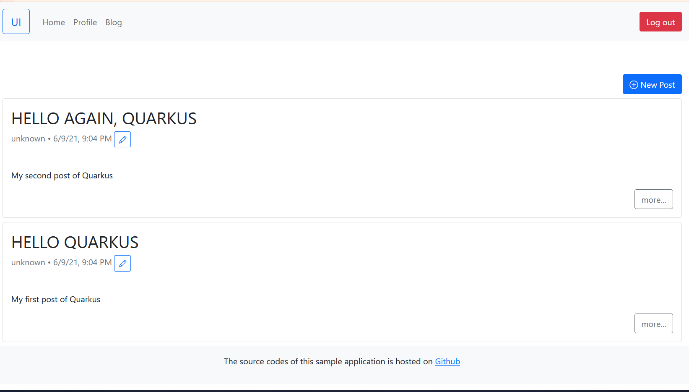

# Secures RESTful APIs with Quarkus OIDC and Auth0

Quarkus has great support of OAuth 2 and OIDC protocol, in this post, we will explore how to protect RESTful APIs with Quarkus OIDC and Auth0.

[Quarkus](https://www.quarkus.io)  is well-known as a *supersonic subatomic Java framework* to build Kubernetes-friendly cloud native applications. In [an earlier post](https://itnext.io/secures-rest-apis-with-spring-security-5-and-auth0-41d579ca1e27) we have discussed  how to secure  RESTful APIs with Spring Security and Auth0, we will implements the same functionality with Quarkus framework.

Go to [Quarkus Start Coding](https://code.quarkus.io/) , make sure you have added extensions: *oidc*, *resteasy*, *resteasy-jackson*, *hibernate-validator* , *hibernate-orm-panache*, *jdbc-postgresql*.  Then generate a project skeleton as usual that we have done in the [former posts](https://itnext.io/building-graphql-apis-with-quarkus-dbbf23f897df). Import the source codes into your IDE.

Open the project *pom.xml* file you should see the following dependencies. Add an extra *Lombok* dependency.

```xml
<dependency>
    <groupId>io.quarkus</groupId>
    <artifactId>quarkus-oidc</artifactId>
</dependency>
<dependency>
    <groupId>io.quarkus</groupId>
    <artifactId>quarkus-resteasy</artifactId>
</dependency>
<dependency>
    <groupId>io.quarkus</groupId>
    <artifactId>quarkus-resteasy-jackson</artifactId>
</dependency>
<dependency>
    <groupId>io.quarkus</groupId>
    <artifactId>quarkus-hibernate-validator</artifactId>
</dependency>
<dependency>
    <groupId>io.quarkus</groupId>
    <artifactId>quarkus-hibernate-orm-panache</artifactId>
</dependency>
<dependency>
    <groupId>io.quarkus</groupId>
    <artifactId>quarkus-jdbc-postgresql</artifactId>
</dependency>

<dependency>
    <groupId>io.quarkus</groupId>
    <artifactId>quarkus-arc</artifactId>
</dependency>

<!-- Erase getters and setters -->
<dependency>
    <groupId>org.projectlombok</groupId>
    <artifactId>lombok</artifactId>
    <version>1.18.20</version>
    <optional>true</optional>
</dependency>
```

Here we have no plan to explain the development progress of the API itself, the details of the codes are similar to the one we have discussed in [my introduction to Quarkus](https://hantsy.medium.com/kickstart-your-first-quarkus-application-cde54f469973),  check  out [the source codes  of this post from my github](https://github.com/hantsy/quarkus-auth0-sample) and explore them yourself.

Unlike Spring Security, Quarkus Security does not follow the naming(`resourceserver`, `client`and  `authorizationserver` etc. ) of  OAuth2 roles to categorize the configuration properties.  And most of the official Quarkus OAuth2 and OIDC examples and guides are dependent on [Keycloak](https://www.keycloak.org/) -  the open source OAuth2/OIDC compatible authorization server from Redhat.

For a backend application,  to protect the API by a JWT token, Quarkus OIDC can help to parse it and verify it.  Configure OIDC in the *application.properties*.

```properties
# Oidc auth config for resource server
quarkus.oidc.client-id=backend-api
quarkus.oidc.auth-server-url=https://dev-ese8241b.us.auth0.com/
quarkus.oidc.token.audience=https://hantsy.github.io/api
#quarkus.oidc.application-type=service
```

The default *quarkus.oidc.application-type* is *service*, which is used for identifying the application, *service* is equivalent to *resourceserver* in  Spring Security. When parsing the JWT token,  Quarkus OIDC also can discover the  *jwt set url* automatically from  a base *auth-server-url* value if the authorization server supports it. When a token audience is provided, Quarkus will verify it automatically. You can also validate the audience or other items in the JWT token yourself.

```java
//@Provider
public class AudienceValidator implements ContainerRequestFilter {

    @Inject
    OidcConfigurationMetadata configMetadata;

    @Inject
    JsonWebToken jwt;

    @Inject
    SecurityIdentity identity;

    public void filter(ContainerRequestContext requestContext) {
        String aud = configMetadata.get("audience");//.replace("{tenant-id}", identity.getAttribute("tenant-id"));
        if (!jwt.getAudience().contains(aud)) {
            requestContext.abortWith(Response.status(401).build());
        }
    }
}
```

The `OidcConfigurationMetadata` is the OIDC configuration properties of this application.  The `JsonWebToken` is the parsed token claims. The `SecurityIdenity` is a general-purpose security context object to envelope the user principal and roles, similar to the traditional Jakarta EE  `SecurityContext`  API from JaxRS, EJB, etc.

To protect the APIs and  make some APIs only be accessible for the authenticated user,  Quarkus Security provides a `@Authenticated` annotation. The following is a modified version of `PostResource` in which we added  a `@Authenticated` on all *write* operations to protect the resources.

```java
@Path("/posts")
@RequestScoped
public class PostResource {
    private final static Logger LOGGER = Logger.getLogger(PostResource.class.getName());

    private final PostRepository posts;

    @Context
    UriInfo uriInfo;

    @Inject
    public PostResource(PostRepository posts) {
        this.posts = posts;
    }

    @Path("count")
    @GET
    @Produces(MediaType.APPLICATION_JSON)
    public Response countAllPosts(@QueryParam("q") String q) {
        return ok(this.posts.countByKeyword(q)).build();
    }

    @GET
    @Produces(MediaType.APPLICATION_JSON)
    public Response getAllPosts(
            @QueryParam("q") String q,
            @QueryParam("offset") @DefaultValue("0") int offset,
            @QueryParam("limit") @DefaultValue("10") int limit

    ) {
        return ok(this.posts.findByKeyword(q, offset, limit)).build();
    }

    @POST
    @Consumes(MediaType.APPLICATION_JSON)
    @Authenticated
    public Response savePost(@Valid CreatePostCommand post) {
        Post saved = this.posts.save(Post.builder().title(post.title()).content(post.content()).build());
        return created(
                uriInfo.getBaseUriBuilder()
                        .path("/posts/{id}")
                        .build(saved.getId())
        ).build();
    }

    @Path("{id}")
    @GET
    @Produces(MediaType.APPLICATION_JSON)
    public Response getPostById(@PathParam("id") final Long id) {
        return this.posts.findByIdOptional(id)
                .map(post -> ok(post).build())
                .orElse(status(NOT_FOUND).build());
    }

    @Path("{id}")
    @PUT
    @Consumes(MediaType.APPLICATION_JSON)
    @Authenticated
    public Response updatePost(@PathParam("id") final Long id, @Valid UpdatePostCommand post) {
        return this.posts.findByIdOptional(id)
                .map(existed -> {
                    existed.setTitle(post.title());
                    existed.setContent(post.content());

                    Post saved = this.posts.save(existed);
                    return noContent().build();
                })
                .orElse(status(NOT_FOUND).build());
    }

    @Path("{id}/status")
    @PUT
    @Consumes(MediaType.APPLICATION_JSON)
    @Authenticated
    public Response updatePostStatus(@PathParam("id") final Long id, @Valid UpdatePostStatusCommand status) {
        return this.posts.findByIdOptional(id)
                .map(existed -> {
                    existed.setStatus(status.status());
                    Post saved = this.posts.save(existed);
                    return noContent().build();
                })
                .orElse(status(NOT_FOUND).build());
    }

    @Path("{id}")
    @DELETE
    @Authenticated
    public Response deletePost(@PathParam("id") final Long id) {
        this.posts.deleteById(id);
        return noContent().build();
    }

}
```

To test the application manually, log in the auth0 dashboard,  follow the steps we have introduced  in [the original Spring Security and Auth0 post](https://itnext.io/secures-rest-apis-with-spring-security-5-and-auth0-41d579ca1e27) to get a token by the Test Application provided by auth0 and then use `curl` command or Postman like tools to access the protected APIs. 

In Spring applications, Spring Security provides test utilities  to mock MVC  in the unit tests, unfortunately Quarkus does not provide such a simple helper .  But there are some possible approaches to test the security concern of the *service* type application.

Add the following dependencies in the *pom.xml* file.

```xml
<dependency>
    <groupId>io.quarkus</groupId>
    <artifactId>quarkus-test-security</artifactId>
    <scope>test</scope>
</dependency>

<dependency>
    <groupId>io.quarkus</groupId>
    <artifactId>quarkus-elytron-security-properties-file-deployment</artifactId>
    <scope>test</scope>
</dependency>
```

To focus on testing the business logic in Quarkus applications, you can use embedded users  in a properties file to replace the  real users in the database and enable Http Basic authentication to pass by the JWT token authorization.

Create a *src/test/resources/application-embedded-users.properties* file to setup the embedded users and  enable *basic* auth .

```properties
quarkus.security.users.embedded.enabled=true
quarkus.security.users.embedded.plain-text=true
quarkus.security.users.embedded.users.alice=password
quarkus.security.users.embedded.roles.alice=user
quarkus.security.users.embedded.users.admin=password
quarkus.security.users.embedded.roles.admin=admin
quarkus.http.auth.basic=true
quarkus.oidc.enabled=false
```

Create a  `QuarkusTestProfile` to categorize the test resources for some special purpose.

```java
public class PropertiesFileEmbeddedUsersProfile implements QuarkusTestProfile {
    @Override
    public String getConfigProfile() {
        return "embedded-users";
    }
}
```

Create a simple test to apply this test profile via the `@TestProfile` annotation.

```java
@QuarkusTest
@TestHTTPEndpoint(PostResource.class)
@TestProfile(PropertiesFileEmbeddedUsersProfile.class)
public class TestSecurityLazyAuthTest {


    @Test
    public void testGetAllPostsWithoutAuth() {
        //@formatter:off
        given()
            .accept(ContentType.JSON)
        .when()
            .get("")
        .then()
            .statusCode(200);
        //@formatter:on
    }

    @Test
    //@TestSecurity(authorizationEnabled = false)
    public void testCreatPostsWithoutAuth() {
        //@formatter:off
        given()
            .body(Post.builder().title("test title").content("test content").build())
            .contentType(ContentType.JSON)
        .when()
            .post("")
        .then()
            .statusCode(401);
        //@formatter:on
    }

    @Test
    @TestSecurity(user = "alice", roles = "user")
    public void testCreatPostsWithAuth() {
        //@formatter:off
        given()
            .body(Post.builder().title("test title").content("test content").build())
            .contentType(ContentType.JSON)
        .when()
            .post("")
        .then()
            .statusCode(201);
        //@formatter:on
    }
}
```

Additionally,  you can generate a local RSA public/private key pair to emulate the JWT token verification progress.

Generating Keys with OpenSSL. 

```bash
openssl genrsa -out rsaPrivateKey.pem 2048
openssl rsa -pubout -in rsaPrivateKey.pem -out publicKey.pem
```

An additional step is needed for generating the private key for converting it into the PKCS#8 format.

```bash
openssl pkcs8 -topk8 -nocrypt -inform pem -in rsaPrivateKey.pem -outform pem -out privateKey.pem
```

Create a `TestProfile` class to setup the properties to use local public key to verify the JWT token.

```java
public class InlinedPublicKeyProfile implements QuarkusTestProfile {
    @Override
    public Map<String, String> getConfigOverrides() {
        return Map.of(
                "quarkus.oidc.client-id", "test",
                "quarkus.oidc.public-key", "MIIBIjANBgkqhkiG9w0BAQEFAAOCAQ8AMIIBCgKCAQEAzcAl1DgYnAkpYelL4lxl" +
                        "csdX0dHj92g+pMyjzWE3nzSV8i726lTJtg5kxaJyv8epEOAiMcelFk0v+9HMOPla" +
                        "6/pgkEHE5PPyaHlgegDIzge2RQLidDwl8IWBksUkfDWjQk+JfrEPJxrES4OXUOyp" +
                        "mO/XsNIGcbZfopi1Ook7XIjBPohuiHBcp8Fw1NVzaP7EvyYzxcxoIpa4Y/knF1Sa" +
                        "FIBuMmA/lE7PHKlBqcsS1EXkyI1TBGcdH+VWhUvsDVehKSlZoUCE6XrWY3M/xzyb" +
                        "gN+C9KPln+fQZ42Fnqo6PpD++NWRo8vgWxsMsqb+nltEQADfd8CFEuLt1BvObh8N" +
                        "fQIDAQAB",
                "quarkus.oidc.token.audience", "https://service.example.com",
                "smallrye.jwt.sign.key-location", "privateKey.jwk"
        );
    }

}

```

Now write a test to verify it. The `getAccessToken` to generate a token using our private key generated in the last step.

```java
@QuarkusTest
@TestProfile(InlinedPublicKeyProfile.class)
public class InlinedPublicKeyAuthorizationTest {

    @Test
    public void testBearerToken() {
        //@formatter:off
        given()
            .auth().oauth2(getAccessToken("alice", Set.of("user")))
            .body(new CreatePostCommand("test title", "test content"))
            .contentType(ContentType.JSON)
        .when()
            .post("/posts")
        .then()
            .statusCode(201);
        //@formatter:on
    }

    //
    private String getAccessToken(String userName, Set<String> groups) {
        return Jwt.preferredUserName(userName)
                .claim("scope", "write:posts")
                .groups(groups)
                .issuer("https://server.example.com")
                .audience("https://service.example.com")
                .jws()
                .keyId("1")
                .sign("privateKey.jwk");
    }
}
```

As you see, use a custom private/public keys in our tests to pass by the public key via jwk set url of the remote authorization server.

Let's put all together and run the application.

Grab the [source codes](https://github.com/hantsy/quarkus-auth0-sample) from github.

Start the application. 

```bash
docker compose up postgresql
mvn clean quarkus:dev
```

Copy the ui codes from [hantsy/spring-security-auth0-sample](https://github.com/hantsy/spring-security-auth0-sample/tree/master/ui)  that we have done in [Integrating Auth0 into your Angular applications](https://itnext.io/integrating-auth0-into-your-angular-applications-42fabef31f3e). It is a SPA application written in Angular 12.

```bas
npm install
npm run start
```

Open your browser and navigate to http://localhost:4200. Login and click the *Blog* menu item, you will see the data from the backend *API* application.

